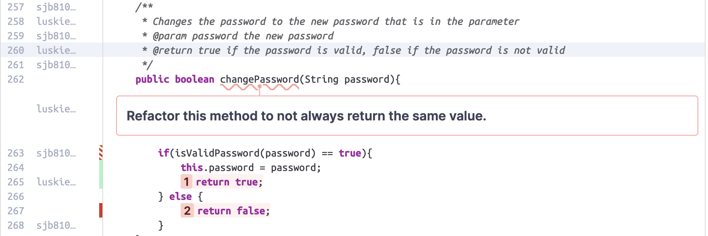

# DiceSpice Design Documentation

## Team Information
* Team name: DiceSpice
* Team members
  * Mark Luskiewicz
  * Lara Toklar
  * Katie Lawson
  * Scott Bullock
  * Nicholas Gouldin

## Executive Summary
This project is aimed to create an e-store that sells a wide variety of Dice. Users will
 be able to create an account to be a Customer, or login as an Admin/Owner. Owners will 
 not have access to a shopping cart. Items will be added to the e-store only through 
 Admins/Owner, where only they can view every item, modify current items, add new die, 
 or delete die of their choosing. Customers can search for dice via the search bar that 
 contains a fiter, allowing customers to find dice by their color or number of sides, 
 or by simply browsing the webpage that will display all dice in inventory. Customers 
 will have their own shopping cart, which will save through JSON files per each user. 
 Customers can save a shipping address to their account so it is easier to make multiple
 purchases, as well as saving a payment method (credit card). Customers can create a 
 wishlist of dice they want to purchase later, and leave a star rating and review for
 items. Users will also have the option to change their password, along with a requirement
 for a strong password (minimally 8 characters, containing at least one capital, a number,
 and a special character).

### Purpose
We have created an E-store fit for selling different types of Dice. 
Two important user groups and their goals are:
**Customers** 
_Users who wish to purchase from our store_
  * Log in and create an Account
  * Add/Remove items to a Shopping Cart
  * Search for Dice with the help of a search filter
  * Proceed to checkout Dice that are in the Shopping Cart
  * Save Dice to purchase later with a Wishlist
  * Create Ratings on a Product (1-5 Star and Written)
  * Add/Manage Shipping Address
  * Add/Manage Payment Method

**Admin**
_Product Owners/Managers_
  * Log into an Admin Account
  * Manage Inventory
  * Add/Remove Products
  * View Reviews left by Customers

### Glossary and Acronyms
| Term | Definition  |
|------|-------------|
| SPA  | Single Page Application |
| API  | Application Programming Interface |
| MVP  | Minimum Viable Product |
| AC   | Acceptance Criteria |
| DAO  | Data Access Object |

## Requirements
Main features of the Application:

* The application will allow users to login to either an admin or customer account.
* Admin will be able to add, remove, and edit dice in inventory.
* Customers can see dice through a search filter and browse all the dice in
  inventory.
* Only Customers own a shopping cart (can add, remove, and decrement items from it).
* Customers will be able to checkout items in their cart to purchase them.

### Definition of MVP

Users can log into an account or create a customer account. Admins will have the
access of logging into the "admin" account to manage dice in the inventory. Users
can search for a product as well as browse all of the Dice that is being sold. 
Only customers have access to a shopping cart, where they can add/remove dice into.
Customers will have the ability to checkout the items in their cart.

### MVP Features

  * As a Customer, I want an account so that I am able to purchase products.
  * As an Admin, I need an admin account so that only I am able to add, remove,
    and edit items in inventory.
  * As an Admin, I want to add, delete, and edit items in inventory so that 
    customers can purchase my dice.
  * As a User I want to search for products so that I can find Dice based on a
    color or number of sides.
  * As a Customer, I want to own a shopping cart so that I can select, store, and
    manage items before pruchasing.

### Enhancements

Our 10% Enhancements were allowing customers to have a Wishlist, leaving 1-5
star reviews and written reviews on DiceSpice products, and saving their shipping
address and payment methods to use multiple times. A wishlist is used so customers 
can purchase them on a later date, you can also move items from your Wishlist into 
your Shopping cart when you are ready to buy them. Customers can also leave 1-5 
star ratings on a Dice, and an average rating is displayed on each dice being sold. 
All users can view Reviews, but Admins are not able to leave any reviews or star 
rating.

## Application Domain

This section describes the application domain.

* A User can log into/out of an account, which is either a Customer account or Admin account.
* Customers own a shopping cart and wishlist, allowing them to add or remove product to/from their cart or wishlist.
* Customers can browse many products, and many products can go into their shopping cart and wishlist.
* Admins have the ability to add, edit or remove items to/from a single inventory and dont have access to a shopping cart. 
* Inventory contains many products (products consist of an id, color, sides, and price)
* Customers can leave written reviews or star ratings on products
* Customers have their account linked to a shipping address and credit card when they are at checkout
* Items in wishlist can only be brought into the shopping cart, items in the wishlist will not go to checkout

## Architecture and Design

This section describes the application architecture.

### Summary

The following Tiers/Layers model shows a high-level view of the webapp's architecture.

The web application, is built using the Model–View–ViewModel (MVVM) architecture pattern. 

The Model stores the application data objects including any functionality to provide persistance. 

The View is the client-side SPA built with Angular utilizing HTML, CSS and TypeScript. The ViewModel provides RESTful APIs to the client (View) as well as any logic required to manipulate the data objects from the Model.

Both the ViewModel and Model are built using Java and Spring Framework. Details of the components within these tiers are supplied below.

### Overview of User Interface

This section describes the web interface flow; this is how the user views and interacts with the web application.

Every user is required to log in, it is the default page once the website is loaded up.
* From a Customer Perspective: They will see Dashboard containing a Search and all the Dice in inventory.
  Customers can add Dice to their shopping cart by simply clicking on the dice, and pressing the "add to cart" button on the product they wish to purchase. Customers can view their shopping cart through the Shopping Cart Route at the top. When they want to check out, they proceed to the checkout page through the shopping cart. This will prompt them to confirm that their shipping information is correct.
* From an Admin Perspective: They will also see Dashboard containing the Dice in inventory, and can edit
  Dice through selecting dice on that screen. They will also see a Dice router, when clicked it will allow
  the admin to create a new dice and delete dice in inventory.

### View Tier

* Login: At the start, the viewer sees the login page. This allows the user to log in and proceed to the dashboard.
* Dashboard: The dashboard page displays the featured dice, as well as showing the buttons to proceed to the list of dice, the shopping cart, and the wishlist.
* Dice: The dice page shows a list of all of the dice currently in the inventory, allowing the users to look for waht they want.
* Die-Search: The search function allows the user to specifically search for what die they want.
* Die-Detail: When a die is clicked on, the die-detail page opens, which shows information about the die including color, sides, and price. From this menu the user is able to add the die to the shopping cart or wishlist.
* Wishlist: This page allows the user to view what items are currently in their wishlist and add them to their shopping cart.
* Shopping-Cart: This page allows you to view what items are currently in their shopping cart and proceed to checkout.
* Account: This page displays the users information and allows them to change it if necessary.
* Checkout: This page allows the user to pay for the dice in their shopping cart. Once this is done, the user moves to the completed order page.
* Completed-Order: This is a confirmation page telling the user their purchase was accepted. From here they can either log out or return to the dashboard page.

The above sequence diagram shows what occurs when a user attempts to add an item to their cart. The add request is sent to the service file, which then refers to the inventory to make sure the die is in stock. If it is, the die is added and an HTTP status of 200 is returned. Then the cart is redisplayed to the viewer.

The above sequence diagram shows what occurs when an admin adds an item to the inventory. The inventory service file checks to see if the item already exists. If it does, the quantity is incremented. If it doesn't, the die is created using the Dice constructor, and the Dice is added to the inventory. The updated inventory is then returned and the admin is shown the updated dice page. 

### ViewModel Tier

The ViewModel Tier is the point which connects the View to the Model and allows the two to communicate. This consists of two main kinds of classes, Controllers and Services for each feature. The Controller classes are what allows the Angular interface to send http requests from the View to the Model. The Service classes connect the Controllers to the Model classes, and allow for storing multiple instances of a class for later.

* UserController: Controller used to refer to User. Handles creating new users and storing their data.
* ShoppingCartController: Controller used to refer to ShoppingCartService. Handles updating the shopping cart.
* InventoryController: Controller used to refer to InventoryService. Handles updating the inventory, both adding dice to it and removing dice to it.
* WishlistController: Controller used to refer to WishlistService. Handles updating customers' wishlists.
* ReviewController: Controller used to refer to ReviewService. Handles creation and deletion of reviews.
* ReviewStarController: Controller used to refer to ReviewStarService. Handles creation and deletion of star ratings.

* ShoppingCartService: Connects ShoppingCartController and ShoppingCart. This allows users to store items in their shopping carts, and allows for them to be saved.
* InventoryService: Connects InventoryController to Dice. This allows for the creation of dice, which are stored using the inventory.
* WishlistService: Connects WishlistController and Wishlist. This allows users to store items in their wishlist to add to the shopping cart later.
* ReviewService: Connects ReviewController to Review. This allows reviews to be made and put on products for people to see.
* ReviewStarService: Connects ReviewStarService and ReviewStarService. This allows star ratings to be made and put on products.

### Model Tier

This tier manipulates/handles data and informs the ViewModel about the user's actions (It 
doesn't contain application logic). The user will interact with the Client UI (View), through 
Network Connection, then establishes a connection to REST API and service files with data 
binding, then through method calls, it will speak to the Model which will send a File to 
storage.

This tier also handles logins from a User. When a user logs in, a data file is created for them holding their login information, as well as address and credit card info. 

* CartItem: Represents a die inside of a cart, as well as how much of that die is in the cart.
* ShoppingCart: Holds dice to be sent to checkout later.
* ListItem: Represents a die inside of a wishlist, as well as how much of that die is in the list. 
* Wishlist: Holds dice to be added to the shopping cart.
* Dice: Holds the attributes of a Dice.
* LoginRequest: When a user is attempting to log in, the username and password they enter is stored and checked with the database to see if it matches an existing user.
* Review: Holds the list of reviews on a die.
* ReviewStar: Holds the list of star ratings on a die.
* User: Holds the attributes of a User (Customer or Administrator)

* DiceDAO: Interface the Controller talked to, to allow communication to DiceFileDAO.
* DiceFileDAO: Allowed file access to save the state of the inventory in a file.
* ShoppingCartDAO: Interface the Controller used to communicate to ShoppingCartDAOImpl.
* ShoppingCartDAOImpl: Allowed file access to store the shopping cart.
* WishlistDAO: Interface the Controller used to communicate to WishlistDAOImpl.
* WishlistDAOImpl: Allowed file access to store the wishlist.
* ReviewFileDAO: Allowed file access to store the reviews.
* ReviewStarFileDAO: Allowed file access to store the star ratings.
* UserDAO: Interface the Controller talked to, to allow communication to UserDAOImpl.
* UserDAOImpl: Allows file access to store the user information.

In the class diagram, it is shown how Dice are created by the admin, stored, and finally accessed to the user. In the InventoryService file
the admin would create an inventory service so the e-store can store the dice. The admin would call the addDie function with which would add the dice to a Map where the Dice is the key and the quantity of the dice is the value. This dice map is then sent to the DiceFileDAO class and saved.
The DiceFileDAO job is to save and load dice so the InventoryService can function properly and the DiceFileDAO only consists of Dice not other
object. When a user is shopping for Dice they have there shopping cart and the shopping cart class does checks with the InventoryService to see
if the product is availiable or in stock. If the Dice is in stock then the addDice function would be called with the Dice choosen and the
InventoryService so that the Dice can be properly updated. The items that are placed into the shopping cart are represented by the object CartItem
because Dice themself do not have the attribute of quantity.

## OO Design Principles
We have used the following OO principles in our final design:

* Single Responsibility - Each class is responsible for a specific use, and the objects created are made to fit one purpose.

In this example, we show how the ShoppingCart and User interaction is handled. Instead of having a single class that represents the Cart with items in it, we separate it by having a DiceItem and Dice class. This creates a single responsibility for each class as the ShoppingCart is only handling operations of adding and removing dice instead of also needing methods to set the quantity of items inside of it. Also, a CartItem contains a quantity and a Dice, rather than having the Dice itself inside the same class.

* Dependency Injection - We utilized dependency injection in order to abstract the details of lower-level modules for use by higher-level modules. In this manner, the higher-level modules are loosely coupled with their dependencies allowing for easier testing through the use of mocked dependencies. Also, this allows us to swap out lower-level modules in place of other ones without having to interfere with the higher-level modules. For example, if we wanted to change from a file database to an SQL database, we would only need to change the DAO to our persistence tier without changing the controller.

In this example, our ShoppingCartDAO interface is used by the service and then by the controller. The ShoppingCartDAO interface has the dependencies (the implementation) injected by Java Spring upon starting the e-store.

* Law of Demeter - Classes should only talk to immediate collaborators. We created several helper functions, getters and setters to help diminish the need for talking to "stranger" classes.

Using the dependency injection example diagram above, we can see that the controller does not have to
use multiple "dots" to access the DAO. Instead, the controller is able to call a method through the service which then calls the DAO. There is no jumping from the controller directly to the DAO.

* Controller - Acts as the messenger between the Model(data) and View(UI). Controller recieves input, processes it, then the Model will update accordingly, as well as interacting with the View to make sure the UI reflects the state of the application. We created several Controllers, one for each job. Shopping Cart, Inventory, User, etc have their own controller because they are looking for a certain input.

Again using the above diagram, the ShoppingCartController only handles operations between the Service and the front-end. The controller acts as the handler between updating information in the model and being told what to do by the View. This follows for the previously stated controller classes.

## Static Code Analysis/Future Design Improvements

## Testing
This section will provide information about the testing performed and the results of the testing.

### Acceptance Testing

Acceptance criteria tended to be vaguer than we wanted them to be during the planning stages. Acceptance criteria was one of the more difficult parts of planning, since we would realize partway through a sprint what was actually needed for a story to be considered completed and would end up needing to edit the acceptance criteria during the sprint itself. This is something that we are still continually working on improving, though we get more accurate each sprint. 
* Sprint 1 had 6 stories, which all had 100% of acceptance criteria completed.
* Sprint 2 had 6 stories, only one of which didn’t have all of their acceptance criteria met. 
  * The story was that “As an Admin I want to add, delete, and edit items in inventory so that Customers can purchase my dice.” 
  * The acceptance criteria that was unmet was “Given the admin wants to edit a dice when they select the dice they want to edit through the Dice router then they can change the die's attributes (color, sides, etc)”. 
  * When the admin tried to edit a die’s quantity, it wouldn’t save whatever the admin entered and only defaulted to 1. This issue was fixed in sprint 3.
* Sprint 3 had 7 stories, all of which had 100% of their acceptance criteria met.

### Unit Testing and Code Coverage
Our Unit Testing strategy was to achieve a minimum of 90% overall coverage with all tiers having roughly the same percentage. We selected 90% as it was the lowest value that we felt comfortable with in order to have a fully-functional program without too many missed instructions.

With this in mind, we achieved a 93% overall code coverage with the lowest overall percentage being 87% for the shopping cart and wishlist persistence tier. We did not feel the need to nitpick tests in order to get closer to 100% and felt that the current standing works well for our needs.

We do not have any anomalies in our unit testing. All tiers of our e-store are relatively close in total instructions tested.

### Static Code Analysis
Overall, our code didn't have very many problems, though there were a myriad of repeated smaller issues that didn't affect the project overall. There were around 16 sections flagged by SonarQube in our static code analysis that were more severe, though they were also a case of the same error being repeated in different sections of code. The errors mentioned in this section are a few examples of the repeated errors. 

In our changePassword function, it's supposed to return a true/false value based on if the password inputted matches the password that was previously saved for that user. SonarQube flagged that the function should be refactored since it would always return true, no matter if the new and old password matched or not.

For that same changePassword, SonarQube suggested we change our error message to return a constant literal instead of repeating the same string, since it would make refactoring the code more difficult.

In the function setRole, we had a parameter for a username String. SonarQube flagged that this parameter was never used in the function, so it should be removed. 

## Future Design Improvements
If we had more time, we would spend a lot more time making the website look more professional. Currently it’s functional, but it’s not pleasing to look at. There are also some backend issues that still need to be resolved
* We would add custom names to the dice during creation, instead of having them be referred to by their colors and side counts, and there would be an option to add a photo of the product itself as part of the product details. 
* The account page would have different spaces to add a street address, then a town name, and state, etc., similar to how you have to enter a shipping/billing address on a site like Amazon. A user’s account information would also persist unless a user deletes their information. 
* On the login page, there would be a message displaying if a user inputs their login information incorrectly, like if they enter a password that doesn’t meet all of our strong password requirements. 
* On the dice detail page, a user would be able to leave a review that also has their personal star rating and username attached to it, so you could see exactly why certain products got certain ratings.
* We would fix the issue with inventory not updating when a user checks out product from the store, since currently a user cannot add more than the store inventory of a certain product, but the product inventory doesn't show the updated quantity when a product is bought.
* A user can currently check out with no items in their cart, which we would fix by preventing the proceed to checkout button from working unless a user's cart has at least one item in it
* We would improve the search filter to include partials when searching as well, so if a user searches 8 for example, it will bring up D8, as well as D18 or D87 or something similar. 

## Ongoing Rationale

2024/04/17: Sprint 4. As a team, we have distributed the work for the presentation and design doc. Design milestones of finally getting around to fixing
our UI, making everything symmetric and more pleasing the the eye as our site looked too similar to Tour of Heroes. No major team decisions this sprint.
Team communication is still lacking.

2024/04/04: Sprint 3. Major Team decisions on when we should make our UI more pleasing to the eye, decided to work on it after this sprint due to it not being a requirement. 10% enhancement is complete, had to work as a team to get review star to work. Prioritized unit testing more this sprint due to last sprint missing around 2% from other people merging last minute. Still improving team work and communication.

2024/03/19: Sprint 2. Major Team decisions throughout the sprint included trying to determine how exactly we want to make a filtered search, and who will be working on what aspects of the code because over Spring Break not everyone was home or had time to work on the code unfortunately. We were able to overcome by splitting more of the work up, some team members
did take on more work than others, due to these circumstances.
